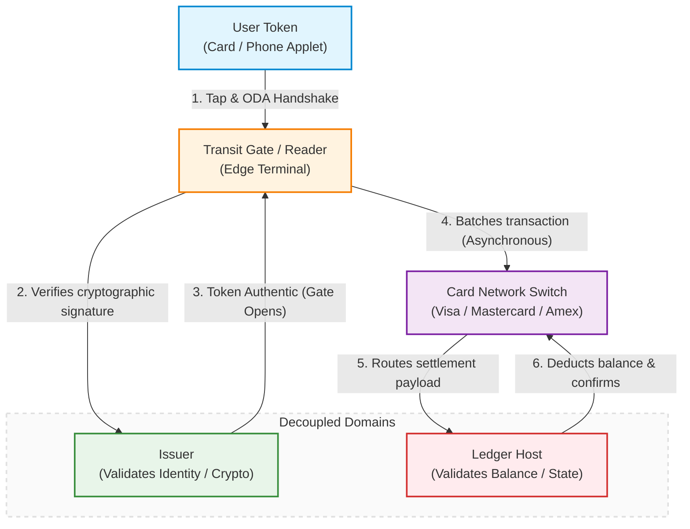

# Introduction: The Road to Seoul

When I initially accepted my offer to Coupang (and consequently made the decision to move to South Korea), I had an interesting mix of expectations and anticipations. There was a lot of excitement, mixed with a healthy amount of dread - after all, this would not be my first across-the-world relocation.

One of the expectations I had was that I would experience, for real, the Asian hyper-connected digital ecosystem, with Korean hyper-efficiency sprinkled on top. What I have seen, however, has been a bit more nuanced than that.

So, where do I start? There are quite a few stories I can tell. On my Threads account (I am ex-Meta, remember?) aptly named [@gmt_plus9](https://www.threads.com/@gmt_plus9), I have been ~~sulking~~ describing my experiences since I boarded my LHR to ICN flight. Today, I figured that maybe I want to elaborate a little bit on those experiences, with a few more words than the microblogging format allows.

# The Hit List

It will definitely take more than one post to describe my experience in Korea. The areas I want to go through are, in no particular order:

- Korean payment systems and their [lack of] integration with global standards.
- The banking system – where hyper-efficiency falls flat, hard, face-first - aka the "Korean banking Byzantine nightmare".
- Maps, navigation, and global services – or, *WHY NO GOOGLE?*
- Surviving without English – and why Android &gt;&gt; iPhone every single time (sneak peek: because of built-in translation).
- Real-name verification for every sneeze – aka the "Korean Privacy Nightmare".

There will probably be plenty more topics, and I will come up with them as I go.
My today's exhibit A is: **do you know you can't pay with your phone for metro in Seoul?**

# The Transit Reality Check

Well, *actually*, you can, but it's kinda complicated. As many things in Korea, it works beautifully if you are a Korean (or at least a ~~filthy~~ recognised foreigner with an ARC card), using a Samsung phone - you tap your phone, it works. Things become *a lot more complicated*, quickly, if you do not fit into the two buckets above.

Firstly, Korean metro doesn't support open-loop payments. Remember Oyster cards in London, and how 10-ish years ago suddenly everyone stopped using them because contactless started working, and daily caps meant that you have to be riding a whole lot more than twice a day to justify a season ticket? Well, this never materialised here - in part, because it became available *a lot earlier* than in London.

Like in many cases, Korea fell the victim of its own success - implementing things before they became mainstream, and never bothering to upgrade when global standards finally caught up. It’s the classic early-adopter trap. Because Korea built an incredibly successful, proprietary smart-card transit network in the early 2000s (so-called T-Money), the entire infrastructure became calcified around closed-loop smart card technologies and local telecom standards.

# Deep Dive into Architecture

This is where it becomes really interesting from the software engineering and security standpoints.

The closed loop system is, in a way, an obvious thing to do because it's the most simple thing to do. It's monolithic, it's symmetric and in many ways, it's just obvious. The same entity acts as an issuer, acquirer, processor and ledger host. This is quite a handful, and when I started reading up about it, it took me a little while to unpack - let me try to explain it using simple words - using open-loop system as the counter-example.

In such a system, a single tap when you are paying for your sandwich-and-coffee in Pret (or indeed your morning portion of ~~misery and suffering~~ Tube journey), involves a complex dance between multiple distinct, federated entities, specifically:

- The issuer - aka the bank that gave you the card (think HSBC or Citibank or Barclays)
- The acquirer - the bank processing the merchant transaction (could be one of those above, or literally anything else - it's an open system, remember? - or a specialised processor, such as Worldpay)
- The processor (Visa, Mastercard, Amex) - the technical switch actually routing the data
- The ledger host - the entity which actually keeps the tab of all the transactions, and moves money from pocket A to pocket B.

Since I'm adamantly ignorant of anything payment processing, it took me a while to understand what's the difference between the issuer and the ledger host: in one sentence, the issuer verifies who you are by validating the cryptographic token on your phone or card, while the ledger host verifies what you have by managing the actual database where your balance lives. 

In other words, when the gate at the Tube verifies your card, they have no physical capability to actually check your balance in real time (otherwise you'll have a huge queue of people tsk-ing at you), so it trusts the cryptographic signature on your chip to prove it's a real card. For traditional retail banks like HSBC, they seamlessly play both roles under one roof. But in more modern setups - like a tech company using a specialised partner bank to issue its cards, or a transit system tracking your journeys in its own backend database before batch-billing you at midnight- the entity issuing the token and the ledger host checking your balance are completely decoupled.

With me so far? Great. Well, for closed-loop systems, all of the above is the same entity. Everything is a single monolithic infra - there's no federated network, one single operator owns the entire vertical stack from the plastic key in your hand, to the database server doing the bean counting. They are:

- The Issuer - they mint the card and control the proprietary symmetric keys on the chip (therefore the auth is rapid, local handshake that doesn't need to traverse the global financial system)
- The Acquirer and Processor - they own and manage the physical turnstiles, readers, and private internal routing pipelines, with no Visa or Mastercard in the picture whatsoever
- The Ledger Host: they run the central database that tracks your balance (or journeys, in case of post-paid), setting transactions instantly or at the end of the month.

Here's the curious thing: your travel balance *actually lives on the card chip!* When you tap, the terminal securely modifies the state of the physical card asset and logs the transaction to sync with the central database server. When I got my kids so-called Namane prepaid cards, it took me a while to understand why to see the balance of the *travel* portion of the card, or update it I have to physically tap it on my phone NFC chip - well, *that's why.* They use 3DES with 168-bit encryption, so even if you flinch at hearing about storing actual balance on the untrusted edge device - this is kinda secure-ish (or at least secure enough for their purpose - there are some additional security optimisations which I wouldn't go into).

# The Operational Reality & Outro

**ANYWAYS** this is how this thing works right now ~~which is why we can't have the nice things~~. Making it open-loop compliant, as you could guess, will require replacing *every single turnstile at every single Seoul metro station* - which, by conservative estimate, involves ~340 stations in Seoul Metro network alone, or 750+ if you take into account the Greater Seoul Metrpolitan Subway network. This is a lot of turnstiles. Like, think 10K+ turnstiles. 

And that is exactly why you are standing in front of the machine with your Climate card, hunting for a physical 1,000 KRW note (OK you can now actually top-up your Climate Card with a physical foreign credit card, but it just sounds more dramatic this way). Tearing out and replacing or retrofitting over 10,000 hardened edge terminals isn't just an astronomical hardware expense; it is a logistical and cryptographic nightmare. Every single one of those new open-loop turnstiles would need to be re-architected to securely handle multi-tenant network authentication, transit gateway routing, and real-time risk scoring, all while maintaining that holy grail of transit metrics: opening the gate in under 300 milliseconds so rush hour doesn't grind to a halt *and *probably maintaining compatibility with old T-Money infra, somehow.

So, until the local transit consortium decides that welcoming a few million frustrated tourists and freshly arrived expats is worth a multi-billion-won infrastructure overhaul, we are stuck in Korean version of the digital future, 2004 edition - you will hear this song over and over again in future posts.

Up next - "Korean Banking Byzantine nightmare": what happens when you actually try to get the local bank account required to fund this entire ecosystem in the first place. Stay tuned.
